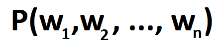
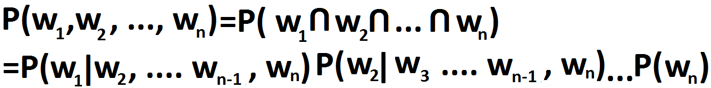
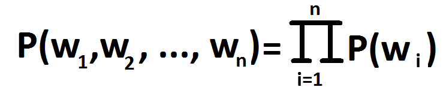
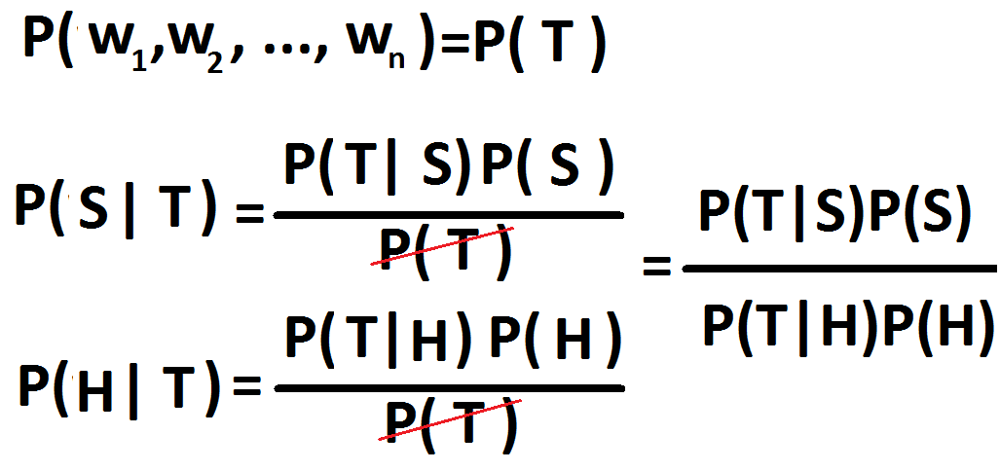
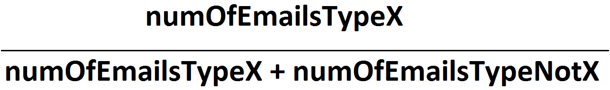
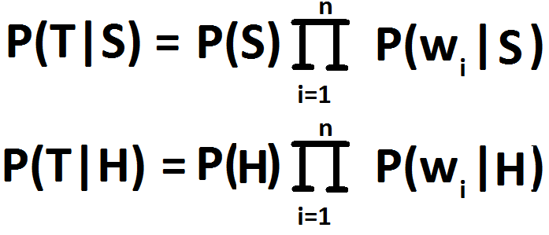
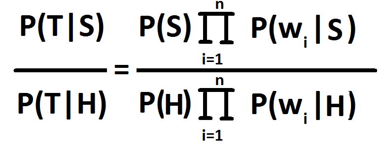
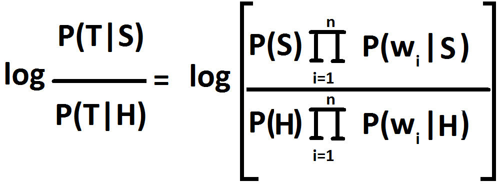
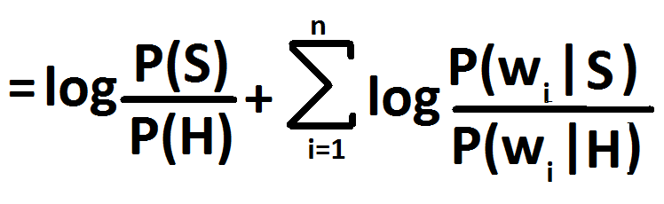
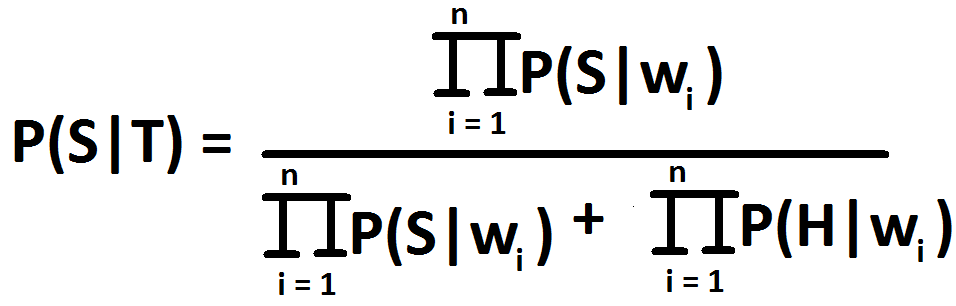

Naive Bayes classification is a famous way to filter spam emails. It is based on using the data extracted from the training dataset to perform filtering. The extraction process is in turn based on various implications of probability.

You will need to know about conditional probability, there's plenty of good resource of that available.

# **Naive Bayes classification**

* * *

# **I ) Idea**

* * *

In order to classify a document, we divide and conquer. **Therefore the probability of an email being anything is the probability of each individual words being anything.**

However, stricly speaking, this probabilty must represent our email precisely, which means that each word must appear in proper English syntatic order. This condition makes sense, because the probability of finding a verb is influenced heavily by the immediate adjective.

We have to find the probability of one word given all of the rest, then one word of the rest given the paritioned rest, ... This goes on for a while. Point is, it is a daunting task and in some cases we can't even find those probabilites due to the our limited training data set. Because of this difficulty, **we employ an assumption that words occur independently from each other**. This assumption is invalid in the real world, but it works well in practice. Under this assumption, we have, in accordance with Bayes thereom, our formal probability of a sequence of words.

**We are interested in the probability of an email being a Spam or Ham given it has a squence of words**. Then calculate their ratio, if the ratio is smaller than 1, it's a ham, otherwise it's a spam.

We see that in the ratio there's **P(T|S), P(S), P(T|H), P(H)**, those are the factors we need to calculate.

- **P(S) / P(H)**  is obtained easily from the training data set which has already been classififed.With **X = spam or ham and notX = ham or spam**, respectively.
- **P(T|S)** and **P(T|H)** are the probabilities that the interested sequence of words appearing in spam emails and ham emails in training dataset, luckily we have established independence assumption, therefore they can be computed from Bayes Theorem:
- **The denominator is intentionally left out** because as we divide P(T|S) by P(T|H), the common denominator is cancelled out.

Therefore we have the ratio as: 

There is a catch here, however. There's a phenomena called **floating point underflow.** It basically means that we have to spend extra efforts in representing a number that's very very very small. Such number could appear in the denominator or the numerator of our ratio since probabilities are always smaller than 1. That fact combined with the act of multiplication can result in an extreme number such as 0.0000000000000084.

To solve this problem, we can either implement our own class bigNum to represent number of any range, or we can take the logarithm of our ratio. We will employ the latter since it is more convenient than implementing anything. Logarithm can make a big number small and a small number big, because it represents number in terms of scales ( logarithm is the inverse operation of exponential - therefore it has contrary effect ).

 

Because logarihm makes any number smaller than 1 into negative and any number bigger than 1 positive, we have to change our classification criteria. **If the ratio is positive then the new email is classified as spam, otherwise it's a ham.** 

Avid reader may notice the case where the dataset does not contain a word that appears in the new email we want to classify. If we leave it be, then the probability of that word in either spam or ham would be zero, which would make everything zero. We do not want that, therefore it would make sense to assign a probability of words that do not appear in the data set. If we do not have reasons to think there are more spam than ham or vice versa, then we would assign a probability of 0.5.

## Paul Graham's method 

Paul Graham adopted that unbiased assumption, reducing the classification to the formula:

**There is another way to classify spam emails**. We can let the threshold be 0.9, so if **P(S|T) > 0.9** then it's considered a spam email, anything less is ham.

* * *

# **II ) Implementation:**

* * *

For implementation, we can do the following:

1. **Training data set:**
    1. Break an email into individual words.
    2. Create a hash table, looping over all words and hash them into the table, with key being the string representation and value being an object that keeps a spamCount, hamCount, spamRatio, hamRatio. Count a word once in a email even if there are multiple occurences, since we're only interested about wether a word occurs or not, not how many times it occurs.
    3. **spamRatio = spamCount / totalSpam, hamRatio = hamCount / totalHam**
2. **Filtering new emails:**
    1. Break the email into individual words.
    2. Looping over the words, retrieve the spamRatio and hamRatio of the word from the hash table. We initialize a variable holding the first constant term from the ratio formula. That way, we only have to keep adding spamRatio / hamRatio of every word until the end. If a word is not in the hash table, then give it a **spamRatio = hamRatio = 0.5**
    3. **( Ratio > 0 ? "Spam" : "Ham")**.
