**_Disclaimer:_** This post is based entirely on the content of the book " Engineering a compiler 2nd edition by Cooper and Toczon ". Some clarifications as well as simplifications have been made in the attempt to understand the material.

Scanner takes a string of words as input and produces string of words of the output language. The scanner touches every single character of the input, and the input can be very large, therefore we need to emphasize speed in this stage.

# **Recognizing words**

By adopting a fair assumption that is each word is separated by a white space, the obvious thing to do is to consume each character until a white space is found. A programming approach would be the if - then - else structure. An abstraction would be a diagram like the following: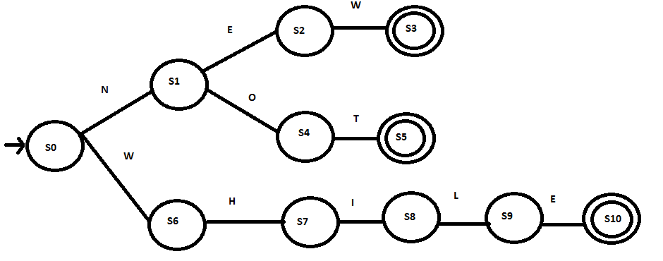

Such abstraction can be viewed as a finite mathematical object, called _**finite automata**_

# **(S, Σ, δ, s0, Sa)**

- S is the finite set of states.
- Σ is the alphabet.
- δ is the transition function that takes 2 argument ( state A  , alphabet b ) and spits out a new state which is the transition from state A on alphabet b.
- s0 is the start state.
- Sa is the set of accepting states.

Using this mathematical object, we can say that a string is accepted if exhausting every characters from the input takes the FA from its start state to an accepting state. Or formally, a string x1x2.....xn is accepted by an FA if and only if

# **δ(δ(δ....(δ(δ(δ(s0,x1),x2),x3)..... ,xn) ∈ Sa**

If while in the process an error is encountered ( that is, either a character swallowed that does not cause transitions from the current state, or either the input is exhausted and the current state is not an accepting state ), the error should be reported and the string is not recognized.

If we can implement FA efficiently, it should run proportionally to the length of input.

# **Recognizing complex words**

If - then - else is only useful for the case of specific words, like _new_ or _not_ or _while._ We often, however, want to recognize something much more abstract. For example, to recognize an integer, we might us the following FA. 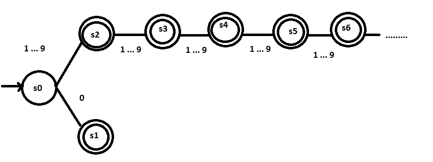

First, it is not finite, _finite automata_ needs to be finite. Second, the states from s2 onwards are identical. This raises a concern about the distinction betwen a class of words and any  particular word. **The class is a _part of speech_, the specific word is the class's _lexeme_.**

Simplifying the diagram by allowing cycles yields the result:

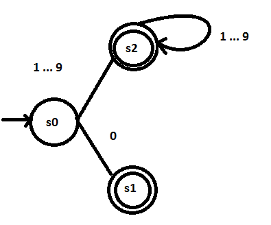

This is much more clean compared to the previous infinite one. However, cycles are allowed at the expense of tradinf off if-then-else construct, we have to use a loop instead to implement this kind of model. Additionally, we also need a table to control cyclic control flow.

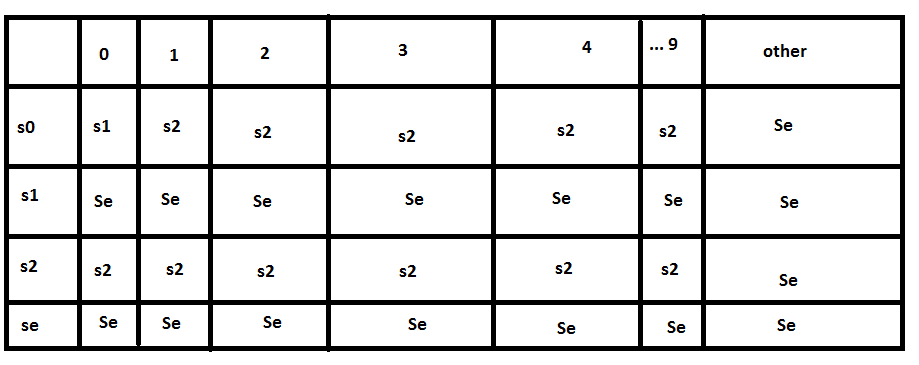

Seems like too much, but truth is we can reduce it to just three columns 0 - 1 ... 9 - others. Also once we enter a state of error we stay there so there is no need to represent that again and again.

# **Regular Expressions**

FA is an abstraction that describes well many languages, but it is not an abstraction that human beings find intuitive. Therefore another description of language is proposed, namely _regular expression._

**An RE describes a set of strings over the characters in the alphabet Σ augmented with the empty string ε**. For a given RE ( r ), the set of strings it describes is called the language **L(r).**

An RE is built up by three basic operations:

1. **Alternation**: The union of two sets of strings.
2. **Concatenation**: Perpending an element of a set onto one in another set.
3. **Closure**: The union of cancatenations of a set with itself, zero or more times.

Comments in C++ appear under the form // write your comment here. Equivalently, in regex:

# **// ( ^\\n ) \* \\n**

(^n) means any character in the alphabet except for **\\** or n or \\n. If we disallow \* then the regex would have been simple, but in reality we don't have that restriction. The FA looks something like this: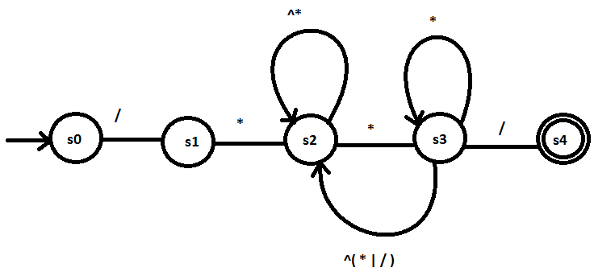

The transition from s2 to s3 encodes the fact that the second \* has been recognized and from there are two scenerios that need to be addressed. The first case is that what's just been observed is a part of the comment's content. The second case is that the \* observed marks the end of the comment.

We can see that FA looks pretty space-consuming in comparision with RE. However, more complex REs may produce FAs with more states that in turn may consume more space. The cost of FA remains one transition per input character.

Trying to group many REs together might yield undesirable result, such as at the expense of compactness, we trade away the human-friendliness of REs.

For example,  _r_(\[_0...2_\](\[_0...9_\] | ) | \[_4...9_\] | (_3_(_0_ |_1_ | ))) describes the name of the registers from 0 - 31. It takes more efforts to interpret, and if given that hardship, we might as well use something that is easier to decode, like FA. The above representation is equivalent to  _r0_ |_r00_ |_r1_ |_r01_ |_r2_ |_r02_ |_r3_ |_r03_ |_r4_ |_r04_ |_r5_ |_r05_ |_r6_ |_r06_ |_r7_ |_r07_ | _r8_ |_r08_ |_r9_ |_r09_ |_r10_ |_r11_ |_r12_ |_r13_ |_r14_ |_r15_ |_r16_ |_r17_ |_r18_ |_r19_ |_r20_ | _r21_ |_r22_ |_r23_ | _r24_ |_r25_ |_r26_ |_r27_ |_r28_ |_r29_ |_r30_ |_r31._ The clear drawback would be the tiredness of enumeration, but clearly we humans just have to look at the first and the last element to interpret the meaning. As a result, this form is more prefered when the number of states is relatively small.

#  **--- Technically irrelevant ---**

Lexical analysis is based on the assumption that spelling implies uniqueness. This decision has simplified scanning, parsing and pretty much every process taking place in a compiler. In natural language, a spelling of a word does not uniquely define its meaning. For example, stress can be both a noun and a verb in different contexts. Mimicking the natural language is not a primary goal of programmning language, although it is ideal that programming language is as understandable as possible, it is neither logical nor efficient to allow complications that outweight the flexibility.

# **Properties of regular expressions**

Regular expressions are closed under many operations - concatenation, union,  closure, complement, etc.

**Closure under union** implies that any finite language is a regular language. Any finite language is built up by individual words, if we construct an RE for each of them and alternate the products together, we obtain another RE which is the RE for that finite language.

**Closure under concatenation** allows more rooms for complexity. RE for ab is guaranteed as long as a is a RE and b is RE. Thus any technique applicable to ab is applicable to a and b.

**Closure under Kleene closure and finite closures**. This property allows infinite sets with finite patterns. As long as we have a pattern, we immediately can construct a set that represents as much vocabulary as we want.

**Closure under complement** implies that we can specify the absence of words in a large pool of words by using their complements. Furthermore, given a complete FA, we can construct an FA that recognizes words that is not in L(FA). This is built simply by swapping the designation of accepting states and nonaccepting states in the original FA.

# **Nondeterminstic Finite Automata**

There are two types of finite automata with the core differences as followed:

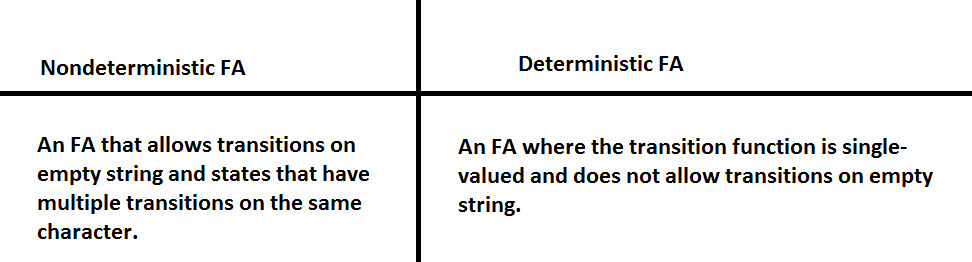

To make sense of NFA, we need to have a set of rules that governs its behaviors like the one we established with DFA. Historically, there are two such rules:

1. Each time NFA must make a nondeterministic decision, it makes the transition that will lead to an accepting state for the input string. This model essentially guesses the transition correctly everytime, it is appealing because it guarantees an accepting state.
2. Each time NFA must make a nondeterministic decision, it clones itself to explore each possible transition. At any point, NFA may exists at multiple stages which is the result of transitioning differently on a given input from the clones. We call the set of states NFA is active in its **configuration** at any given moment. When the NFA reaches a configuration where it exhausts the input string and consists of at least an accepting state, the NFA accepts the string.

# **Equivalence of DFA and NFA**

Any NFA can be simulated by a DFA.

Here's the intuition: Consider the NFA with n states and an alphabet **Σ** at any point during the input string. The NFA right now can be in at most n states. At any stage, the NFA can have at most |**Σ|** clones. Therefore the NFA can have at most |∑|n  configuartions.

We can build a DFA for each configuration of the NFA. The number of configurations may be large but at least finite, and DFA consumes a character every transition, so DFA still runs proportionally to the length of the input string. A space problem may arise, but a time problem cannot.

# **Regular Expression to NFA: Thompson's Construction**

Rules: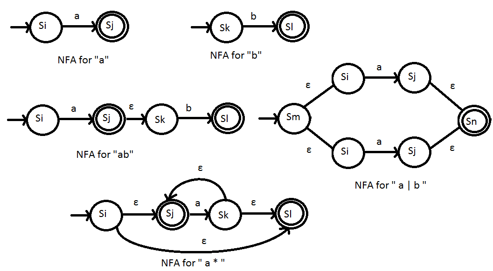

Breaking down a RE by the following precedence rules:

- Always build NFAs for each character in RE.
- Parantheses have the highest precedence.
- Closure has higher precedence than concantenation.

Simple enough. Thompson's construction produces NFAs that have special properties that simplify implementing. First of all, there is one starting state and one accepting state, so that we don't have to deal with a set of accepting states. Each transition on empty string connects two states that were previously the accepting state and the starting state of two NFAs. Finally, each state has at most two entering and two exiting **ε-**moves, and at most one entering and one exiting move on a input character.

# **NFA to DFA: The Subset Construction**

Because DFA execution is easier to simulate than NFA execution, we would like to convert NFA to DFA after having converted RE to NFA.

# **(S, Σ, δs, s0, Sa) ---->** **(D, Σ, δd, d0, Da)**

The algorithm takes an NFA and produces an DFA. Input and and output has the same alphabet **Σ.** The construction will yield s0 and d0. The complex part is figuring out the new transition function **δd** and the set of states D from S.

The algorithm is best understood as followed:

1. Find the empty string closure of the set of starting states of the NFA, the result is the starting state of the equivalent DFA. Initialize an empty stack.
2. Starting out with the set of starting states in NFA ( that is, the starting state in the equivalent DFA), do the following:
    - Iterate all over the alphabet ( which is the same in NFA and DFA ). For each character in the alphabet, find the new set of states that is transitioned from the current set of states using this character, also remember the transition. The new set of states would be a state of the equivalent DFA and the transition is the one being memorized. Push the new set of states onto the stack for further exploration.
    - If a set of states in NFA contains an accepting state, then the equivalent state in DFA is the accepting state.
3. Repeat the process for every set of states on the stack.

The output would be a new set of states, a new transition function, some a set of accepting states and the starting state of the equivalent DFA. That combined with the unchanged alphabet results in the complete equivalent DFA.

An example: 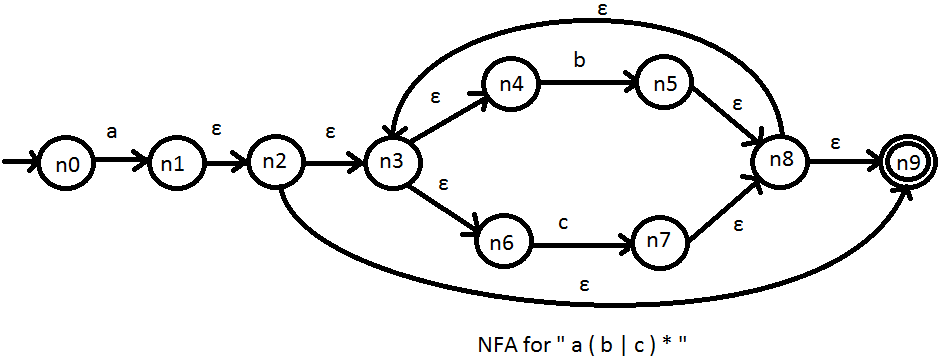

All the steps are encoded in the following table: 

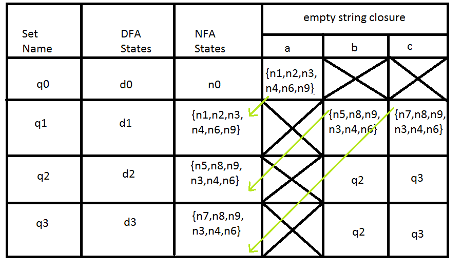

First, compute the empty string closure of n0: { n0 }. The equivalent state in DFA is d0. Empty string closure of the transition from {n0} on a : { n1 , n2 , n3, n4 , n6, n9 }. There is no transition from {n0} on b and c. 

Now consider { n1, n2, n3, n4, n6, n9 }, the equivalent state in DFA is d1. There's no transition on a. Empty string closure of the transition on b is { n5, n8, n9, n3, n4, n6 }. Empty string closure of its transition on c is { n7, n8, n9, n3, n4, n6 }. 

For { n5, n8, n9, n3, n4, n6 }, the equivalent state in DFA is d2. No transition is available on a. Empty string closure of the transition on b is { n5, n8, n9, n3, n4, n6 } which is just itself. Empty string closure of the transition on c is {  n7, n8, n9, n3, n4, n6 } which is same as one of the previously obtained sets.

For {  n7, n8, n9, n3, n4, n6 }, the equivalent state in DFA is d3. No transition is available on a. Empty string closure of the transition on b is { n5, n8, n9, n3, n4, n6 }. Empty string closure of the transition on c is {  n7, n8, n9, n3, n4, n6 }.

At this step, no more new set is presented, so we are done.

Here's the equivalent DFA. Since q1, q2, q3 contain n9 which is an accepting state, d1, d2, d3 are all accepting states.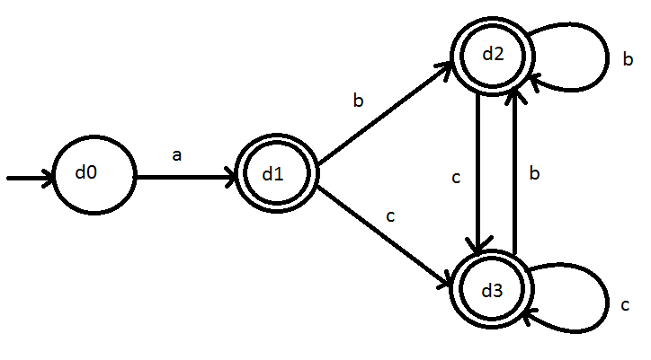

 

# **DFA to Minimal DFA: Hopcroft's Algorithm**

The DFA emerged from the subset construction may contain a large number of states. We have argued that  DFA runs proportionally to the length of the input, so the number of states does not bear influence on the run-time, but that still leaves us with a potential memory issue. The speed of accessing space does affect the computation speed overall.

But what does it mean for a DFA to be minimal ? Well if an DFA contains two states that produce the same behaviors on any input string, that DFA is clearly not minimal.

The following partitioning algorithm takes a DFA as an input and produces a minimized DFA.

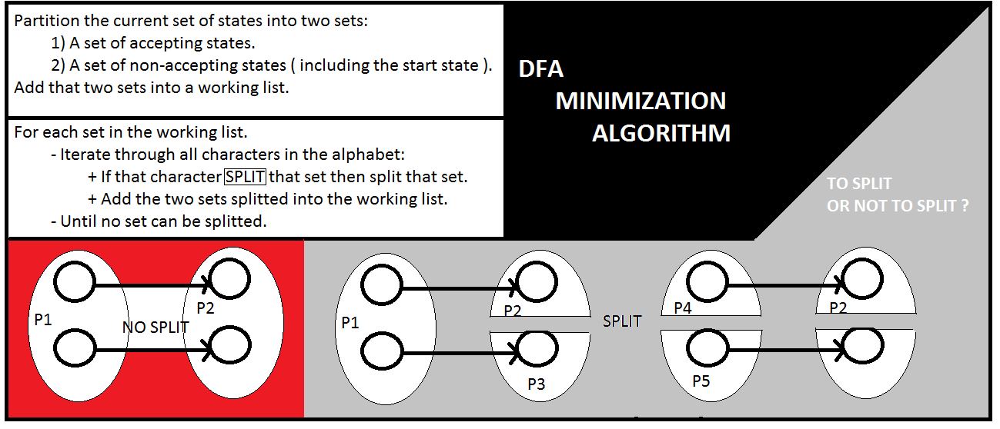

Here's an example:

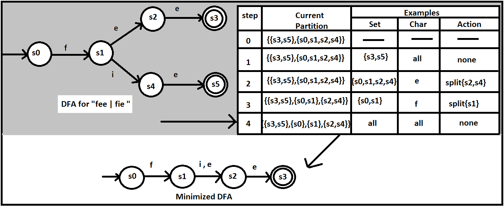

# An example:

**Problem**: Consider the RE _who | what | where_. Use Thompson's construction to build an NFA from RE. Then use the subset construction to build a DFA from NFA. Finally minimize the DFA.

**Solution**:

NFA for individual characters in the alphabet { w, h, o, a, t, e, r } 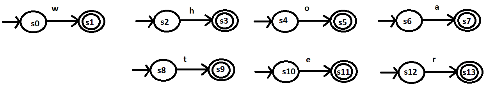

The RE is: _wh( o | at | ere )_ would yield the following NFA following Thompson's construction:

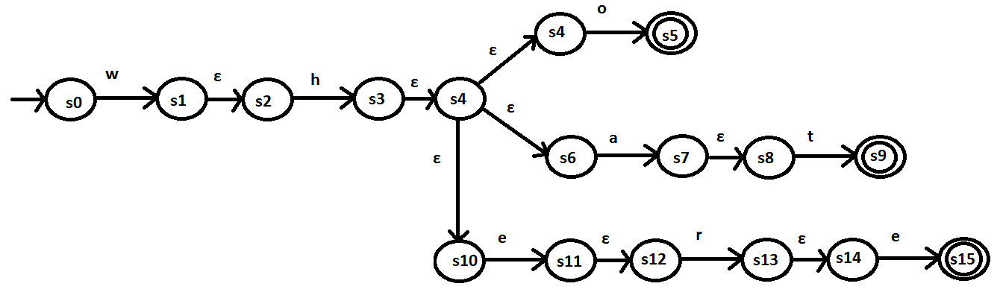

Using the subset construction to convert it into DFA using the subet construction:

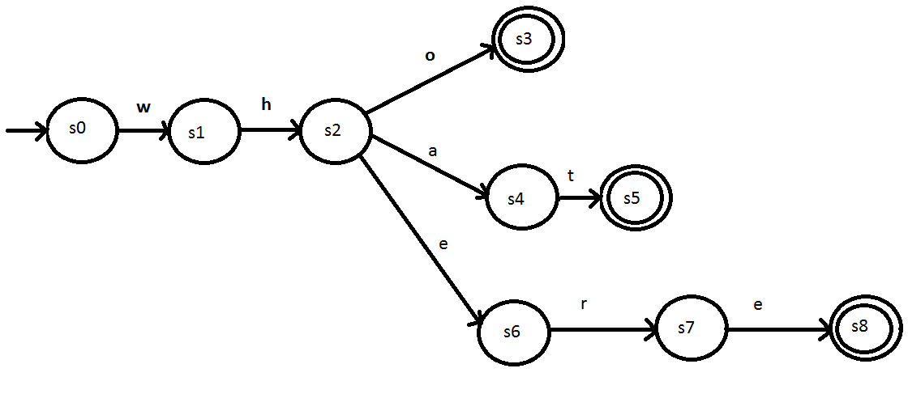

Then using Hopcroft's algorithm to minimize the DFA.

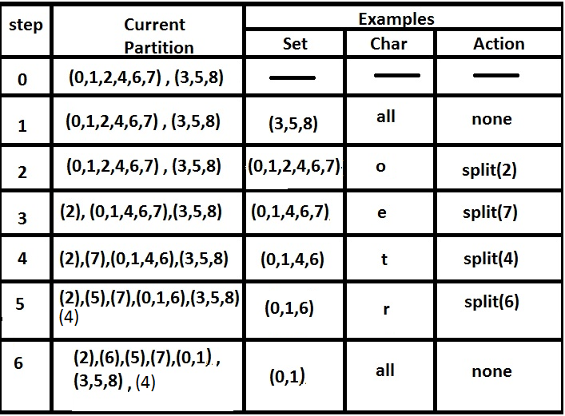

The following minmized DFA is the final result:

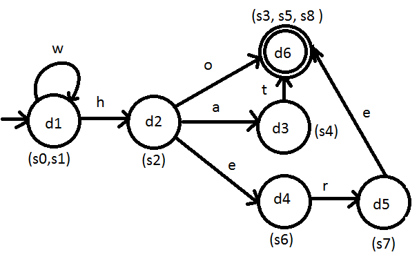
