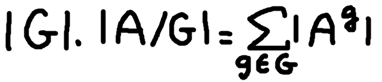
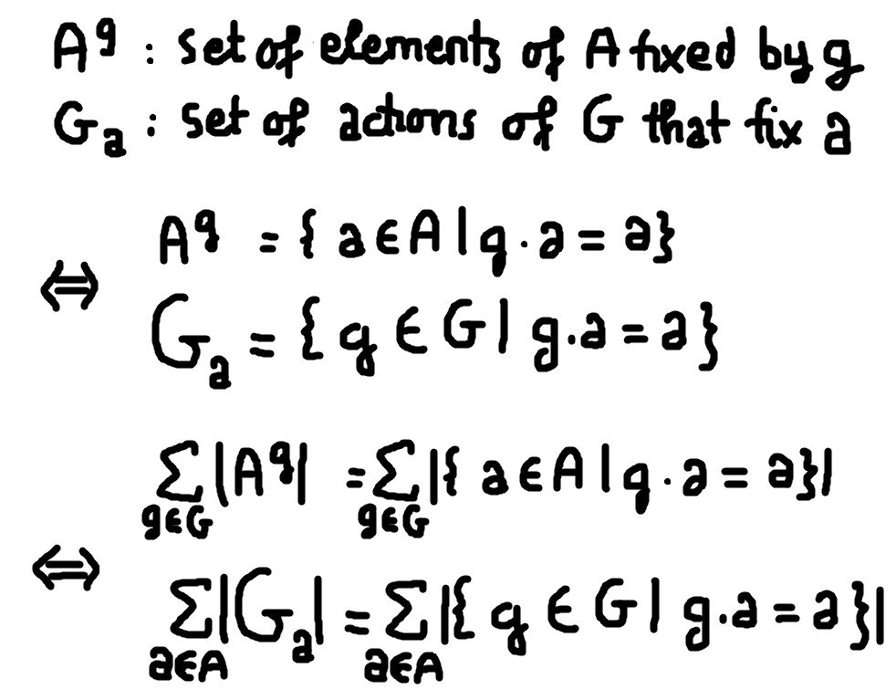
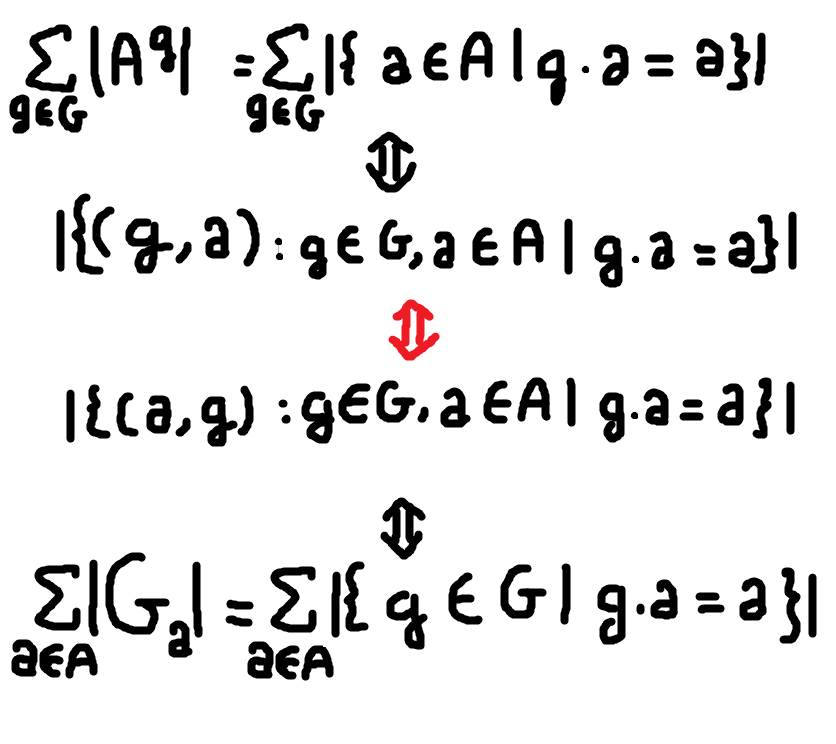
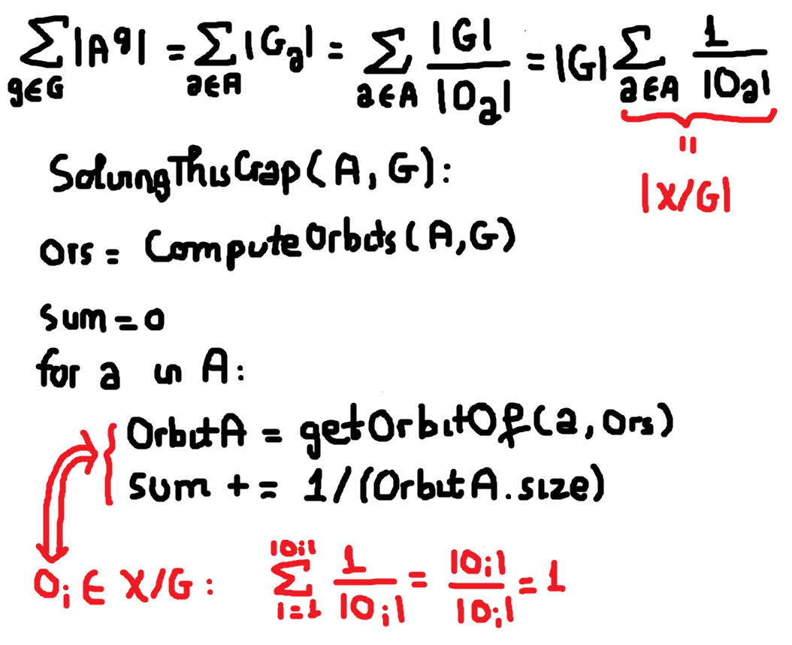
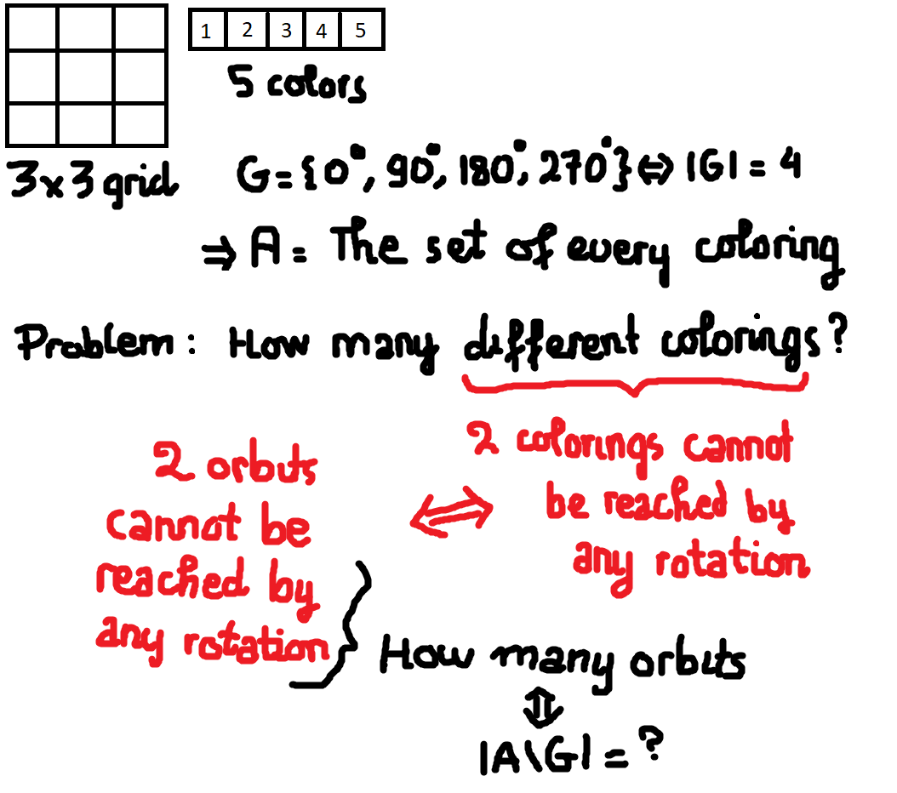
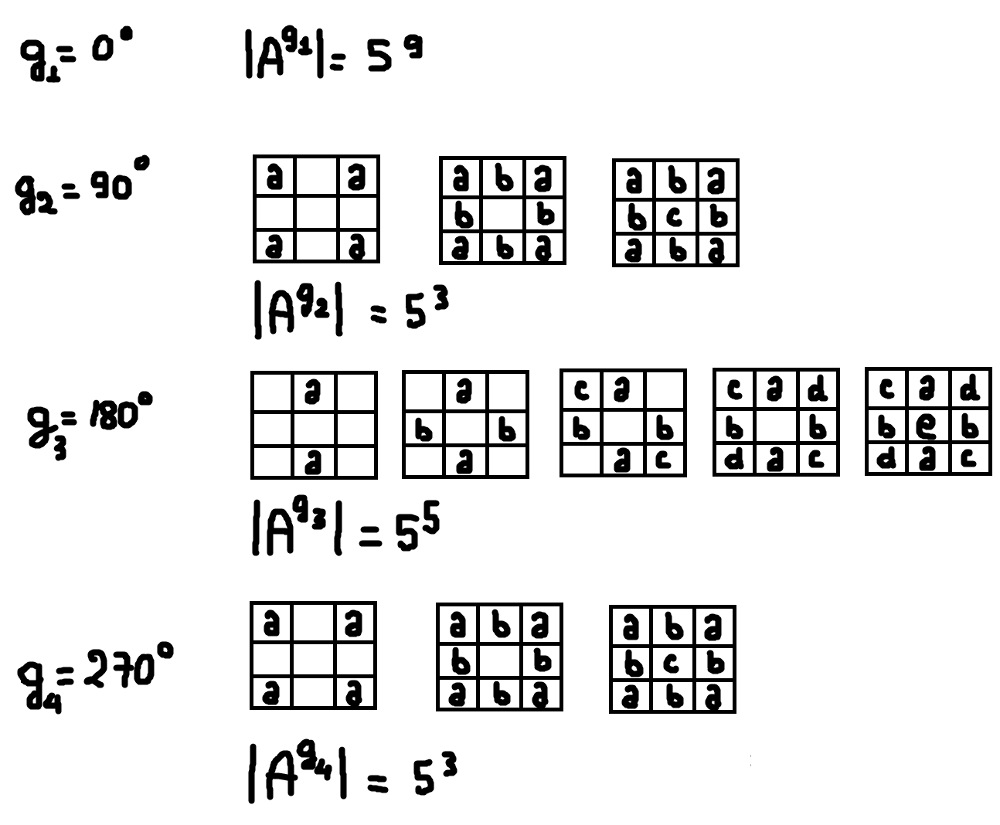
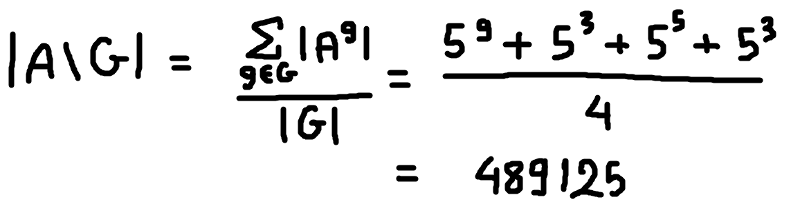

In the [previous post](https://dafuqisthatblog.wordpress.com/2018/10/13/burnsides-lemma-orbit-stabilizer-theorem/), I proved the Orbit-Stabilizer Theorem which states that the number of elements in an orbit of **a** is equal to the number of left cosets of the stabilizer of **a.** 

# Burnside's Lemma

Let's us review the Lemma once again:

 

Where **A/G** is the set of orbits, and **|A/G|** is the cardinality of this set. **Ag** is the set of all elements of **A** fixed by a particular **g.**

I can't think of anyway to put this intuitively, Burnside's Lemma simply states an equation within which if you can find any of the two variables then you can plug them in and solve for the other one.

The significance of this equation is basically that often times **|G|** is already given or clearly specified, and |**Ag|** for all **g** can still be logically deduced, while the number of orbits is not straight-forward.

For the grid-coloring problem I introduced in the beginning of this series, the significance above will soon become obvious. The set of **G** consists of 4 rotations, so its size is 4. We can deduce the number of color configurations by each rotation. The question is to find different color configurations under these rotations, which is essentially the number of orbits - **|A/G|.** Remember, each orbit is disjoint from one another, so each of them represents all configurations that can be reached by any of the rotations, therefore the number of orbits is indeed the number of distinct configurations that cannot be reached by any rotation.

By the time, we prove Burnside's Lemma, we would have accomplished 80% the solution to the grid coloring problem. A small nuisance then is to compute |**Ag|** for each rotation, but this is practically nothing.

But first, let's prove the Lemma first. The notion of **Ag** has not been introduced in the previous post, therefore there is a new component to this problem, we aim to reduce this notation to an already introduced notation. The next question is what already introduced notion would be chosen ? Well, I don't know about you, but there's a nice parallel I can see between **Ag** and **Ga** which perhaps hints us to try to reduce **Ag** to **Ga**.

We sum the cardinality **Ag** across all **g** because it is in the Lemma. To parallel this, we also sum the cardinality **Ga** across all **a.** 

I hope something inside you has already theorized that these two summations are exactly the same. I am going to provide you with a solid reasoning to ensure you that your hunch is correct.

The summation of cardinality of **Ga** across all **a** can be interpreted in a computational way. For each **a** in **A,** and for each **g** in **G,** we apply **g.a** and adds 1 for every **g.a** that returns **a.** 

The same computational perspective can be appied to the summation of cardinality of **Ag** across all **g.** For each **g** in **G,** and for each **a** in **A,** we apply **g.a** and adds 1 for every **g.a** that returns **a.** 

Notice that the interpretation for both summations is counting the number of pair of **g** and **a** for which **g.a** returns **a.** The difference, computationally, is that we iterate over **A** first and then **G** for **Ga,** and iterate over **G** first and then **A** for **Ag.** However, this difference is irrelevant in mathematics, because of t[he distributivity of multiplication over addition](https://math.stackexchange.com/a/342063/466386). In other words, mathematics have ensured that we don't have to worry about the order of summations. Therefore, the summation of cardinality of **Ga** across **a** is the same as the summation of cardinality of **Ag** across **g.** 

Now, let's finally prove this Lemma. We use the just-obtained result, then replacing **Ga** by the Orbit-Stabilizer Theorem. Told you we would need it. Since **|G|** is constant, we pull it out from the summation. Inside, we have **1/|Oa|** summing all over **a.** 

If we can prove that the summation of **1/|Oa|** over all **a** is equal to the number of orbits, then it's Q.E.D.

Again, let's view this under a computational perspective. This summation is represented by the algorithm SolvingThisCrap. The main part of this algorithm is the loop. Inside the loop which iterates over all **a,** we first retrieve the orbit of the element in this iteration, then add one over the size of the orbit. The key observation here is that since we are iterating over all **a,** we will iterate over all elements of any orbit.

That is, given an orbit, then the loop will undoubtedly iterate over all of its element. In other words, for an orbit **Oa**, the loop will iterate **|Oa|** times. Then, because in each iteration it adds **1/|Oa|**, and because this process repeats **|Oa|** times for an orbit, we will get 1 for every orbit. Since **sum** is constantly updated in every iteration, by the time we finish the big loop, the **sum** will be 1 \* The number of orbits, which is just the number of orbits - **|A/G|**.

Therefore, Q.E.D.

# Application of Burnside's Lemma: Orbit counting

So let's re-state the grid-coloring problem.

Here each number represents a color, since I am too lazy to actually color the grid (lol). We just need to consider a coloring to be an element **a** of **A.** Then the problem would become counting the number of distinct groups of **a** such that elements within a group cannot be transformed to elements in another group through any rotation. This means that elements within a group can be transformed into one another through rotations. In other words, formally we can define such a group to be the orbit of an element. Thus, the problem becomes counting the number of orbits. This class of problem is known as orbit-counting problem.

Let's us bring back our good old friend - Burnside's Lemma.

In other to compute **|A/G|**, we need to compute **|G|** and **|Ag|** for every **g.** Let us compute the cardinality of each **Ag:**

With respect to 0 degree rotation:

- All elements are fixed under this rotation, therefore the number of all such elements is the number of all **5^9 colorings**.

With respect to 90 degree rotation:

- Starting with a blank grid, a coloring that is fixed under a 90 degree rotation must necessarily have 4 corners colored the same. You can just visualize to see this must be true. Suppose we fix a color for these 4 corners, then the other 4 blocks must also be colored the same. Again, proof by visualization says that this is a necessity. Fix a color for these 4 blocks, now we are left with 5 choices to color the center. Collectively, there are 5 x 5 x 5 = **5^3 colorings** that are fixed under a 90 degree rotation.

With respect to a 180 degree rotation:

- Starting with a blank grid, a 180 degree rotation sends top-left to bottom-right, top-right to bottom-left, top-top to bottom-bottom, and right-right to left-left. Therefore for each of these 4 pairs, the block must have be colored the same. For each pair we can choose 5 colors, that makes it 5^4. Finally, choose a color for the center. Therefore it's **5^5 colorings** for this rotation.

With respect to 270 degree rotation:

- This is basically a reverse 90 degree rotation, the reasoning remains the same, therefore there are **5^3 colorings**.

Now that we have computed these terms, let plug them in:

So the answer is: There are 489125 distinct colorings where each of them cannot reach one another through any rotation.

* * *

That's it. Hopefully you would grasp the concepts introduced in this series. In the future, I will try to think of an intuitive way to think about Burnside's Lemma. For now I am only able to think of it as a consequence of applying cleverly the Orbit-Stabilizer Theorem.
